# Bold Pitch Modern

**Bold, Energetic, Approachable**

Triadic-accent pitch deck with flat geometry, oversized Montserrat headings, and a grey canvas punctuated by blue and red section dividers. Uses overlapping circles, blob crops, and card grids. Best for startup pitch decks, Series A/B fundraising, and co-working/SaaS products.

## Slide Previews

<table>
<tr>
<td width="50%">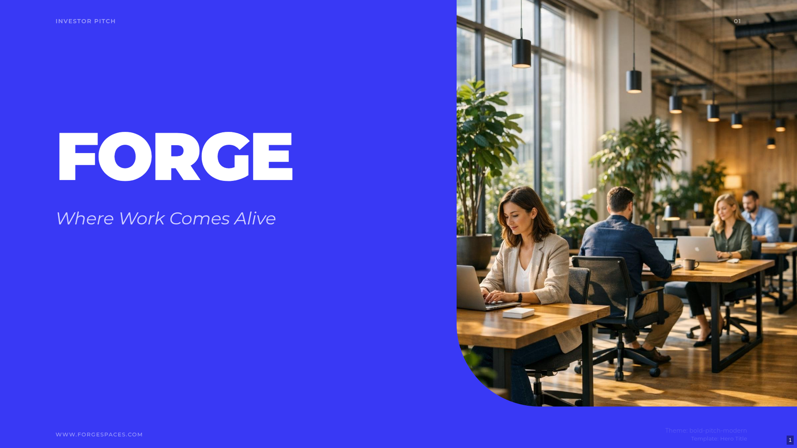 <em>Hero Title</em></td>
<td width="50%">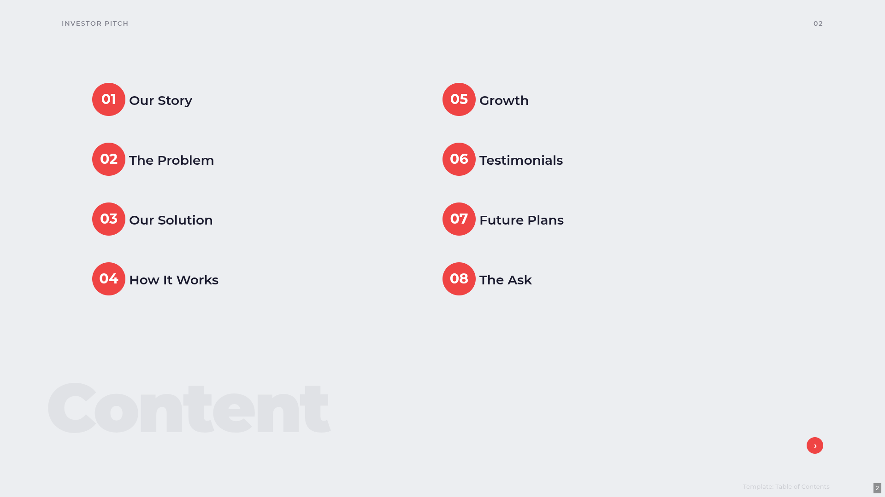 <em>Table of Contents</em></td>
</tr>
<tr>
<td width="50%">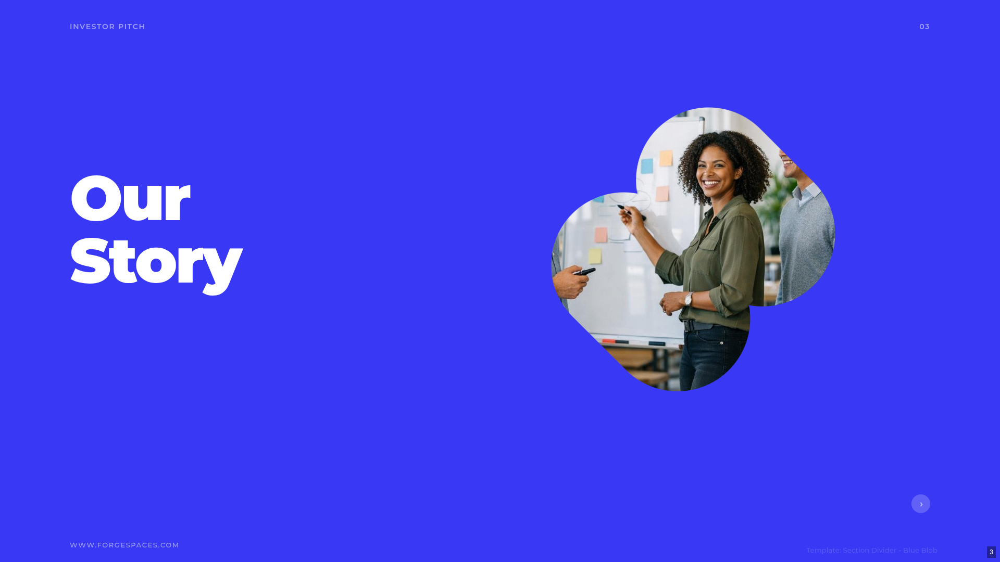 <em>Section Divider (Blue)</em></td>
<td width="50%">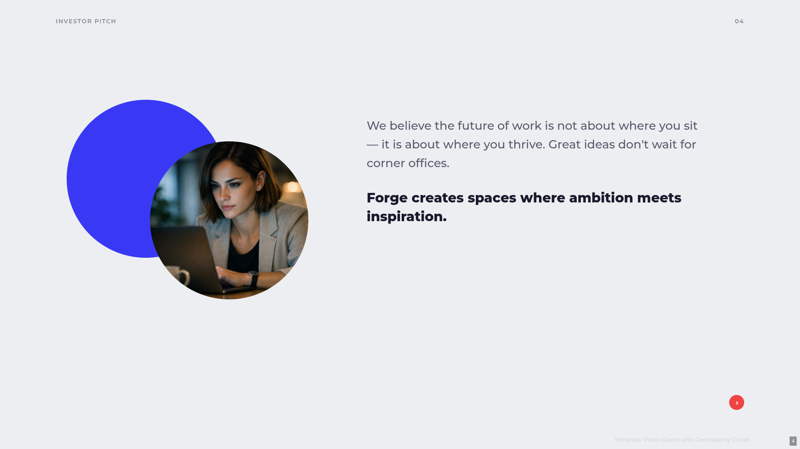 <em>Vision Quote with Overlapping Circles</em></td>
</tr>
<tr>
<td width="50%">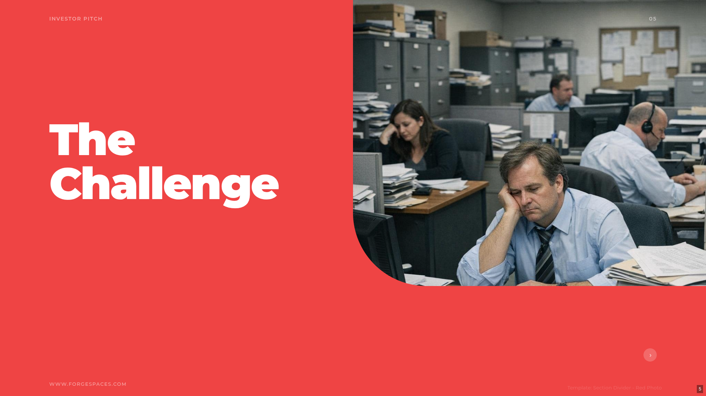 <em>Section Divider (Grey)</em></td>
<td width="50%">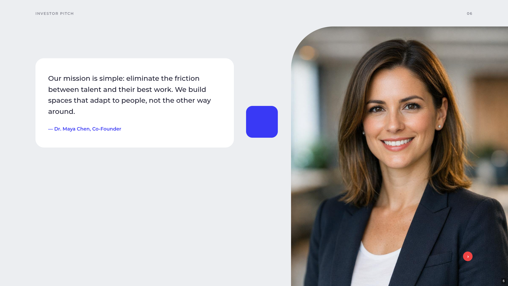 <em>Mission Statement</em></td>
</tr>
<tr>
<td width="50%">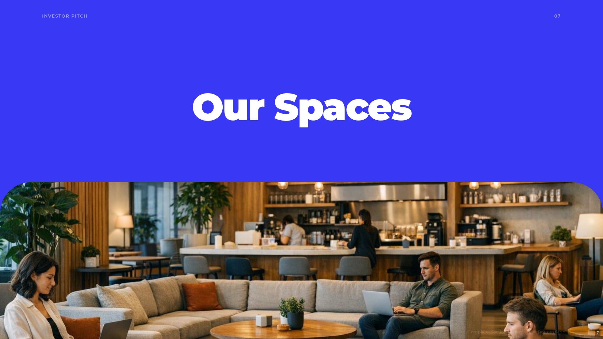 <em>Section Divider (Blue, Photo)</em></td>
<td width="50%">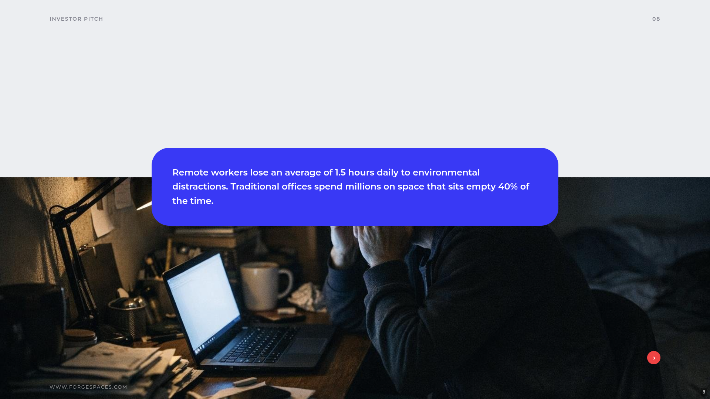 <em>Pain Point (Photo Strip)</em></td>
</tr>
<tr>
<td width="50%">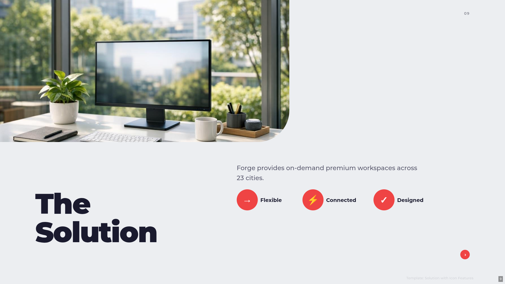 <em>Solution (Photo Strip)</em></td>
<td width="50%">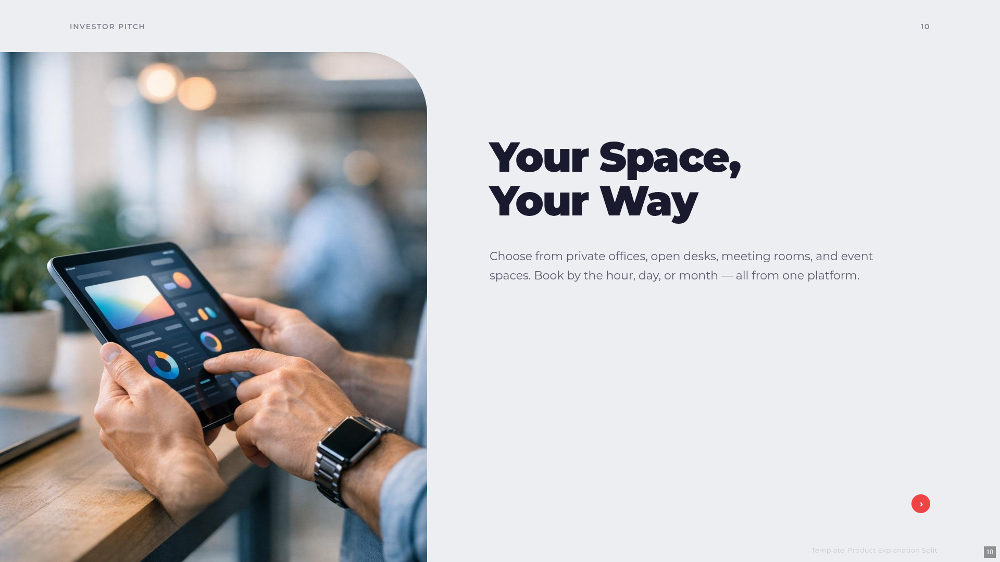 <em>Product Split (Phone Mockup)</em></td>
</tr>
<tr>
<td width="50%">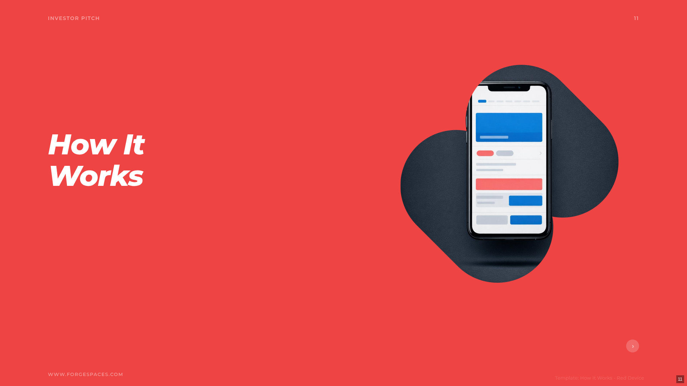 <em>How It Works (Red)</em></td>
<td width="50%">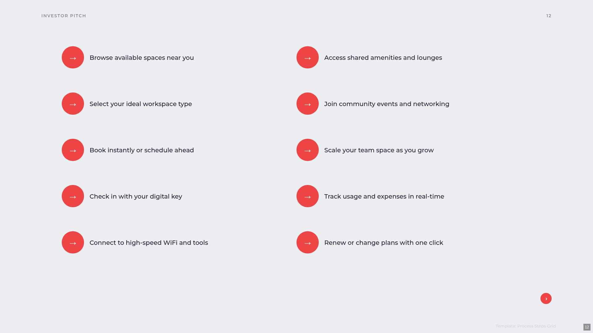 <em>Process Steps</em></td>
</tr>
<tr>
<td width="50%">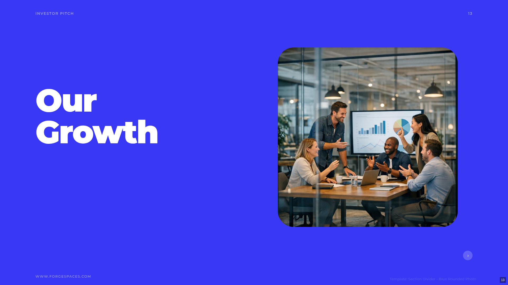 <em>Section Divider (Blue, Photo)</em></td>
<td width="50%">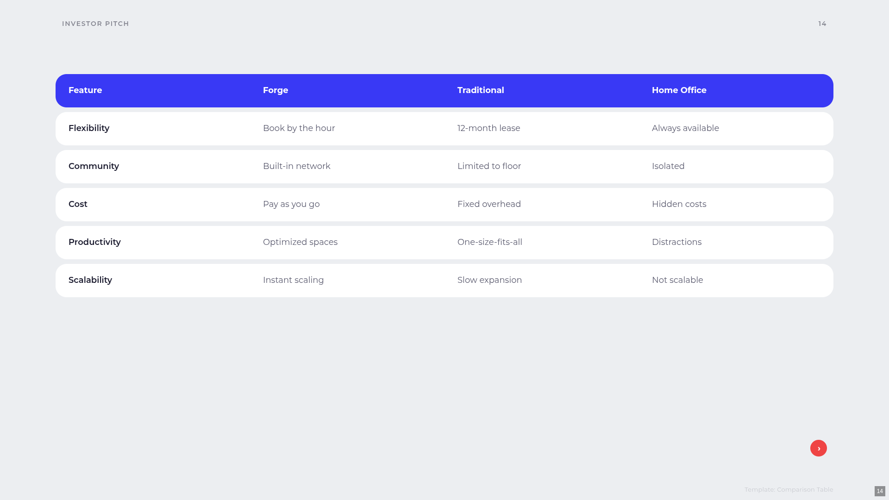 <em>Comparison Table</em></td>
</tr>
<tr>
<td width="50%"> <em>Testimonial</em></td>
<td width="50%">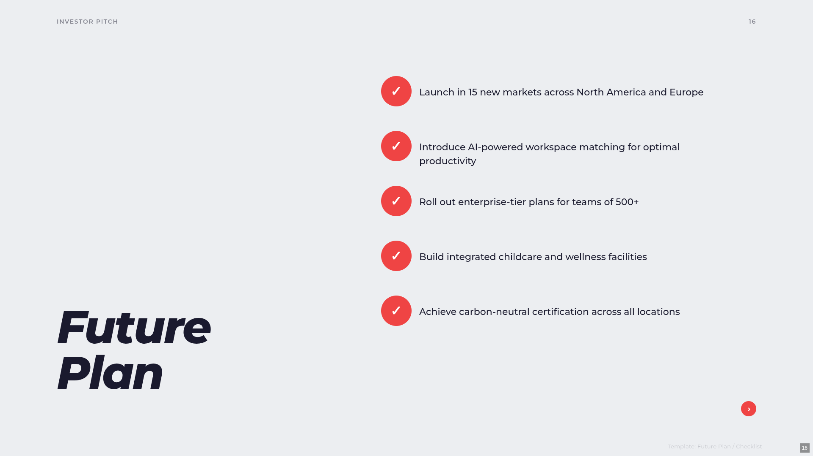 <em>Future Plan (Card Grid)</em></td>
</tr>
<tr>
<td width="50%">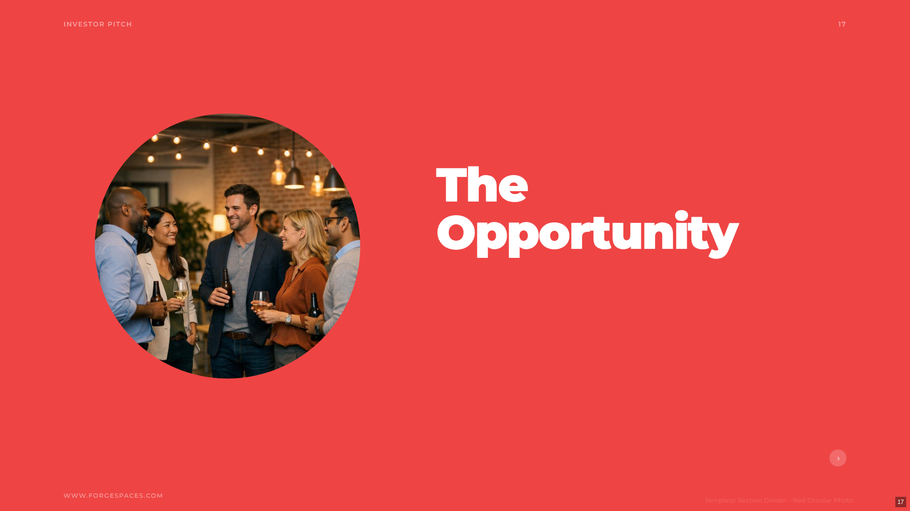 <em>Section Divider (Red)</em></td>
<td width="50%">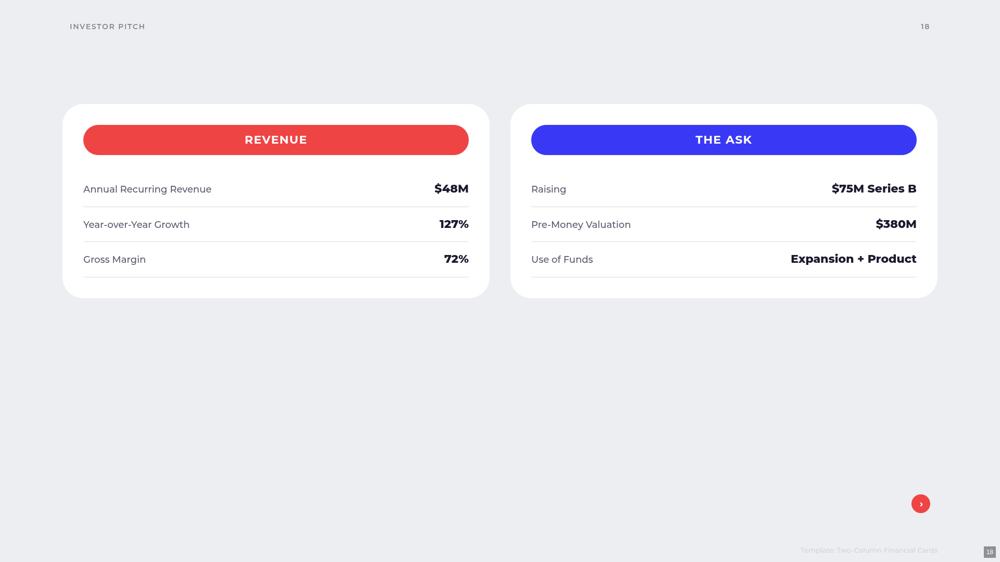 <em>Financial Cards</em></td>
</tr>
<tr>
<td width="50%"> <em>Q&A Discussion</em></td>
<td width="50%">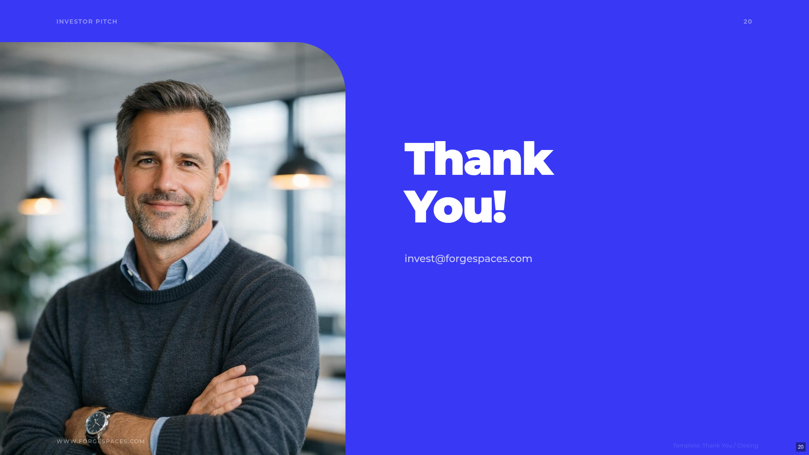 <em>Thank You</em></td>
</tr>
</table>
