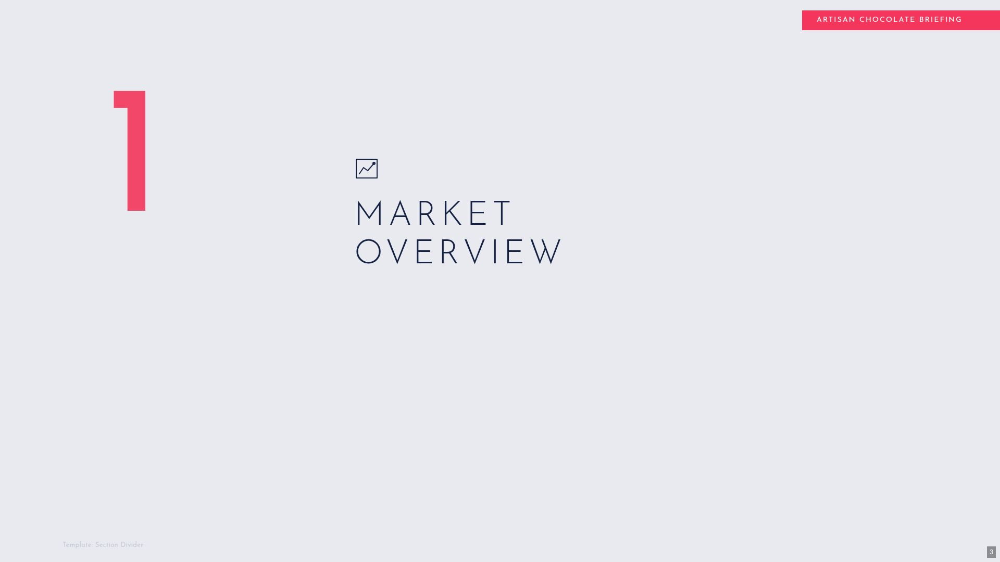

# Slate Coral Corporate

**Sophisticated, Editorial, Data-Driven**

Refined corporate aesthetic blending warm editorial photography with structured data presentation. Deep navy authority (#152244) balanced by coral-red accents (#F5365C) on a cool slate backdrop (#E8EAF0). Uses Josefin Sans. Best for investor briefings, market research, and premium brand presentations.

## Slide Previews

<table>
<tr>
<td width="50%"> <em>Hero Title</em></td>
<td width="50%"> <em>Table of Contents</em></td>
</tr>
<tr>
<td width="50%"> <em>Section Divider</em></td>
<td width="50%"> <em>Three Column Grid</em></td>
</tr>
<tr>
<td width="50%"> <em>Key Highlights</em></td>
<td width="50%"> <em>Content Photo Split</em></td>
</tr>
<tr>
<td width="50%"> <em>Chart Summary</em></td>
<td width="50%"> <em>Color Split</em></td>
</tr>
<tr>
<td width="50%"> <em>Grid with Heading</em></td>
<td width="50%"> <em>Stats Dashboard</em></td>
</tr>
<tr>
<td width="50%"> <em>Quote / Testimonial</em></td>
<td width="50%"> <em>Process / Steps Flow</em></td>
</tr>
<tr>
<td width="50%"> <em>Q&A Slide</em></td>
<td width="50%"> <em>Closing</em></td>
</tr>
</table>
